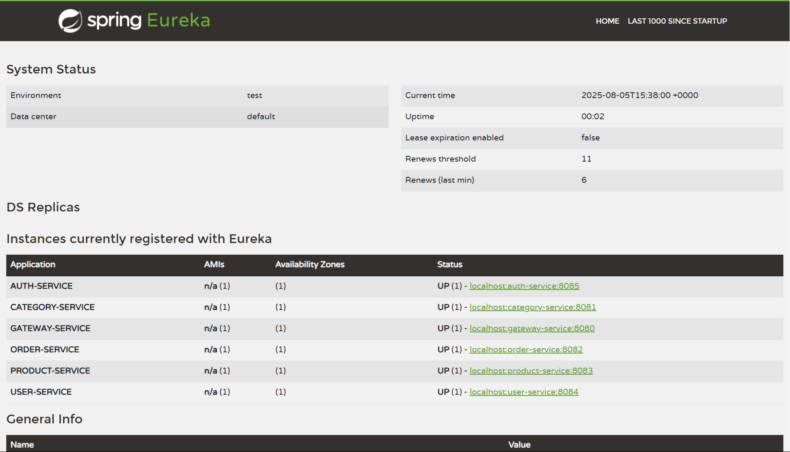
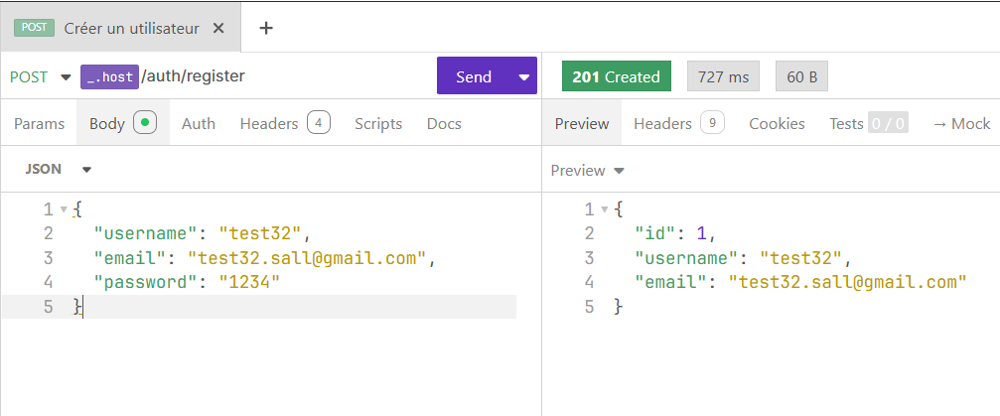
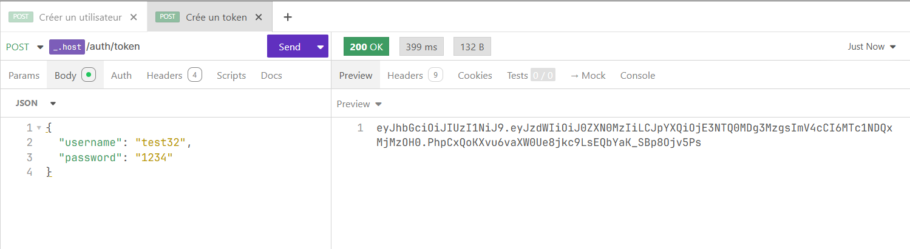
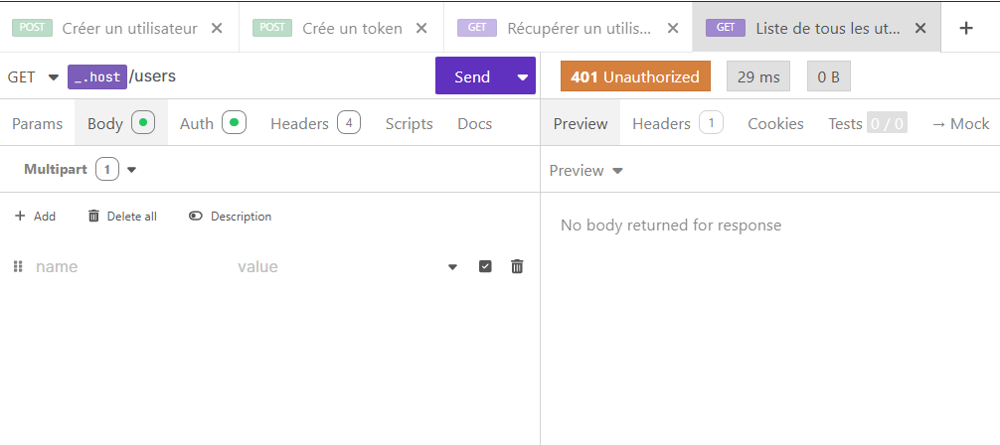
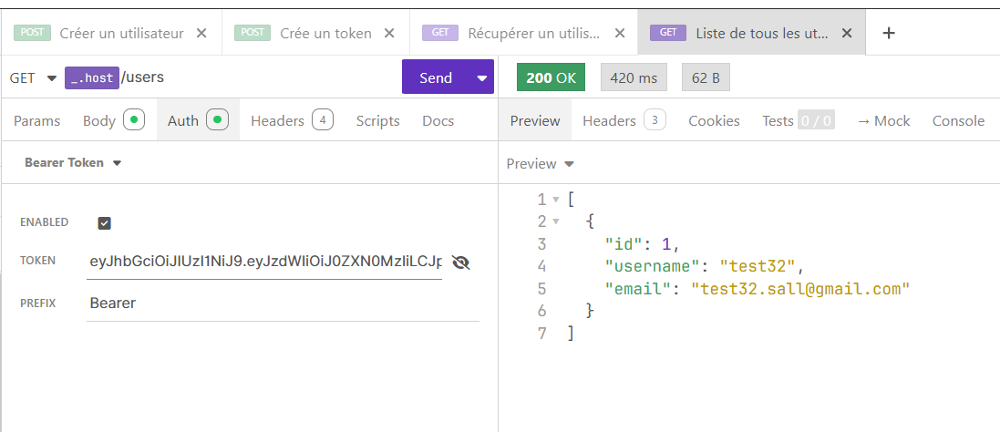
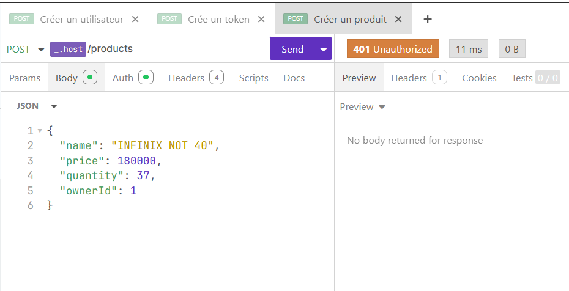
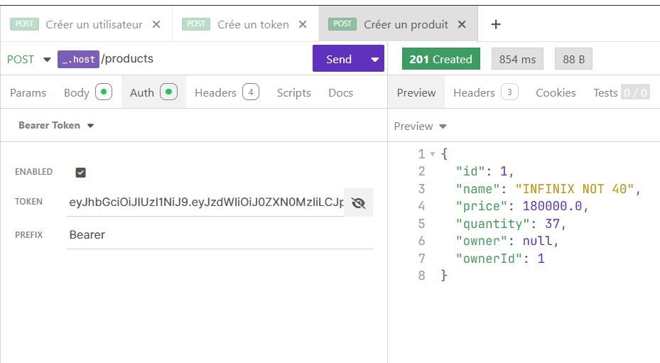
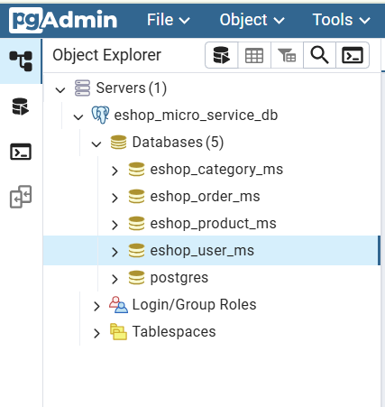

# E-Commerce Microservices Architecture

## Description
Système de commerce électronique basé sur une architecture de microservices utilisant Spring Boot, Spring Cloud et PostgreSQL.

## Test de les micro services 
Pour faciliter les tests, toutes les requêtes API ont été exportées dans une collection Insomnia :
- **Fichier** : [`Insomnia_eshop_api.yaml`](docs/insomnia/Insomnia_eshop_api.yaml)
- **Import** : Ouvrir Insomnia → Import → Sélectionner le fichier YAML
- **Contenu** : Tous les endpoints avec exemples de requêtes et authentification JWT pré-configurée

> **Suggestion** : Importez la collection pour tester rapidement tous les endpoints sans configuration manuelle !

## Table des matières
- [Structure du projet](#structure-du-projet)
- [Architecture](#architecture)
- [Démarrage](#démarrage)
- [API Endpoints](#api-endpoints)
- [Sécurité](#sécurité)
- [Base de données](#base-de-données)
- [Configuration](#configuration)

## Structure du projet
```
eshop-micro-service/
├── eureka-serveur/          # Service Discovery
├── gateway-service/         # API Gateway
├── auth-service/           # Authentication
├── user-service/           # User Management
├── product-service/        # Product Management
├── category-service/       # Category Management
└── order-service/          # Order Management
```

## Architecture

### Services
| Service | Port | Base de données | Rôle |
|---------|------|----------------|------|
| eureka-serveur | 5173 | - | Service Discovery |
| gateway-service | 8080 | - | API Gateway |
| auth-service | 8085 | eshop_user_ms | Authentification JWT |
| user-service | 8084 | eshop_user_ms | Gestion utilisateurs |
| product-service | 8083 | eshop_product_ms | Gestion produits |
| category-service | 8081 | eshop_category_ms | Gestion catégories |
| order-service | 8082 | eshop_order_ms | Gestion commandes |

> NB : j'ai eu des problèmes avec le port par défaut de Eureka (8761), j'ai donc utilisé le port 5173 pour éviter les conflits.

### État des services
Après démarrage, tous les microservices sont enregistrés et opérationnels :

  
*Dashboard Eureka montrant tous les microservices enregistrés et leur statut*

### Technologies
- **Framework** : Spring Boot 3.4.5
- **Service Discovery** : Netflix Eureka
- **API Gateway** : Spring Cloud Gateway
- **Communication inter-service** : OpenFeign
- **Base de données** : PostgreSQL
- **Sécurité** : JWT Authentication
- **Build** : Maven

## Démarrage

### Prérequis
- Java 17.0.15
- Docker & Docker Compose
- Maven 3.9.11

### Démarrage avec Docker
1. **Démarrer PostgreSQL et pgAdmin** :
   ```bash
   docker-compose up -d
   ```

2. **Vérifier que les containers sont démarrés** :
   ```bash
   docker-compose ps
   ```

3. **Accéder à pgAdmin** :
   - URL : http://localhost:5050
   - Email : `admin@eshop.com`
   - Mot de passe : `admin`

4. **Configuration pgAdmin** :
   - Ajouter un serveur PostgreSQL :
     - Host : `postgres` (nom du container)
     - Port : `5432`
     - Username : `postgres`
     - Password : `postgres`

### Ordre de démarrage des services
1. Démarrer les containers : `docker-compose up -d`
2. Démarrer `eureka-serveur` (5173)
3. Démarrer les autres microservices
4. Démarrer `gateway-service` (8080)

### URLs d'accès
- **PostgreSQL** : localhost:5432
- **pgAdmin** : http://localhost:5050
- **Eureka Dashboard** : http://localhost:5173
- **API Gateway** : http://localhost:8080
- **Services** : Accessible via la gateway

## API Endpoints

### Exemple d'utilisation avec authentification

#### Inscription d'un utilisateur

*Inscription d'un nouvel utilisateur via l'endpoint `/api/auth/register`*

#### Génération de token JWT

*Génération du token JWT via `/api/auth/token` - Authentification réussie*

#### Démonstration de la sécurité JWT

##### Accès refusé sans token

*Accès refusé à `/api/users` sans token JWT - Sécurité fonctionnelle*

##### Accès autorisé avec token

*Accès réussi à `/api/users` avec token JWT valide*

#### Gestion des produits avec sécurité

##### Tentative de création sans authentification

*Création refusée d'un produit sans token JWT - Protection des endpoints*

##### Création de produit avec authentification

*Création réussie d'un produit via `/api/products` avec token JWT*

### Authentification
- `POST /api/auth/register` - Inscription d'un nouvel utilisateur
- `POST /api/auth/token` - Connexion et génération de token JWT
- `GET /api/auth/validate` - Validation d'un token JWT

### Utilisateurs
- `GET /api/users` - Liste de tous les utilisateurs
- `GET /api/users/{id}` - Détails d'un utilisateur par ID
- `GET /api/users/username/{username}` - Récupérer un utilisateur par nom d'utilisateur
- `PUT /api/users/{id}` - Modifier complètement un utilisateur
- `PATCH /api/users/{id}` - Modification partielle d'un utilisateur
- `DELETE /api/users/{id}` - Supprimer un utilisateur

### Produits
- `GET /api/products` - Liste de tous les produits avec détails utilisateur
- `GET /api/products/{id}` - Détails complets d'un produit avec catégorie
- `POST /api/products` - Créer un nouveau produit
- `PUT /api/products/{id}` - Modifier complètement un produit
- `PATCH /api/products/{id}` - Modification partielle d'un produit
- `DELETE /api/products/{id}` - Supprimer un produit

#### Gestion des catégories de produits
- `GET /api/products/{id}/category` - Récupérer la catégorie d'un produit
- `POST /api/products/{id}/category/{categoryId}` - Assigner une catégorie à un produit
- `PUT /api/products/{id}/category/{categoryId}` - Modifier la catégorie d'un produit
- `DELETE /api/products/{id}/category` - Retirer la catégorie d'un produit

#### Gestion des propriétaires de produits
- `GET /api/products/{id}/owner` - Récupérer le propriétaire d'un produit
- `POST /api/products/{id}/owner/{userId}` - Assigner un propriétaire à un produit
- `PUT /api/products/{id}/owner/{userId}` - Modifier le propriétaire d'un produit
- `DELETE /api/products/{id}/owner` - Retirer le propriétaire d'un produit
- `GET /api/products/user/{userId}` - Liste des produits d'un utilisateur spécifique

### Catégories
- `GET /api/categories` - Liste de toutes les catégories
- `GET /api/categories/{id}` - Détails d'une catégorie par ID
- `POST /api/categories` - Créer une nouvelle catégorie
- `PUT /api/categories/{id}` - Modifier complètement une catégorie
- `PATCH /api/categories/{id}` - Modification partielle d'une catégorie
- `DELETE /api/categories/{id}` - Supprimer une catégorie

### Commandes
- `GET /api/orders` - Liste de toutes les commandes
- `GET /api/orders/{id}` - Détails d'une commande par ID
- `POST /api/orders` - Créer une nouvelle commande
- `PUT /api/orders/{id}` - Modifier le statut d'une commande
- `DELETE /api/orders/{id}` - Supprimer une commande
- `GET /api/orders/user/{userId}` - Liste des commandes d'un utilisateur spécifique


## Sécurité
- Authentification JWT obligatoire (sauf `/api/auth/**`)
- Filtres d'authentification au niveau de la gateway
- Validation des tokens centralisée

## Base de données

### Structure
Chaque service possède sa propre base de données PostgreSQL :
- `eshop_user_ms` - Users & Auth
- `eshop_product_ms` - Products
- `eshop_category_ms` - Categories
- `eshop_order_ms` - Orders

  
*Vue des 4 bases de données séparées par microservice avec leurs tables générées automatiquement*

### Accès pgAdmin
1. Ouvrir http://localhost:5050
2. Se connecter avec `admin@eshop.com` / `admin`
3. Ajouter le serveur PostgreSQL avec les paramètres :
   - Host : `postgres`
   - Port : `5432`
   - Username : `postgres`
   - Password : `postgres`

## Configuration
Chaque service est configuré via `application.yaml` avec :
- Port d'écoute
- Configuration base de données
- Enregistrement Eureka

---

_Projet développé dans le cadre d'un TP Java 17 Spring boot 3.4.5 (microservice) - Mai 2025_
